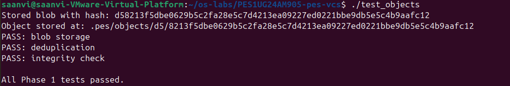
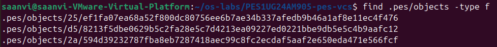
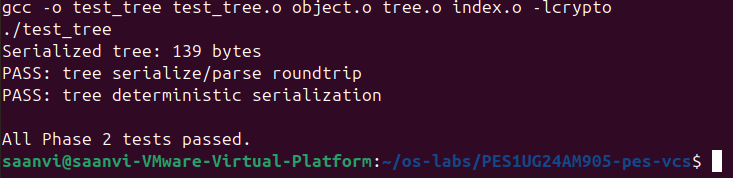
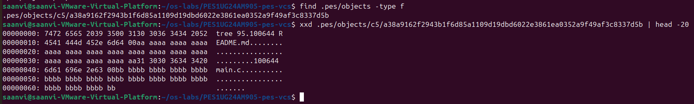
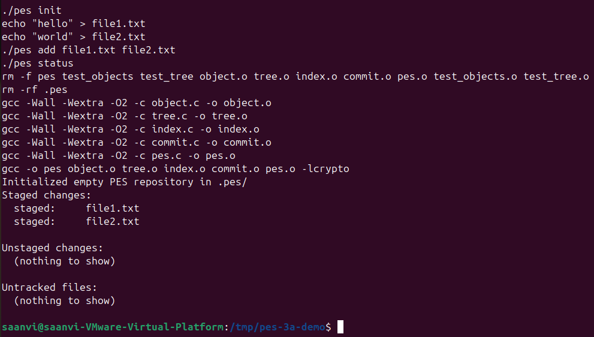
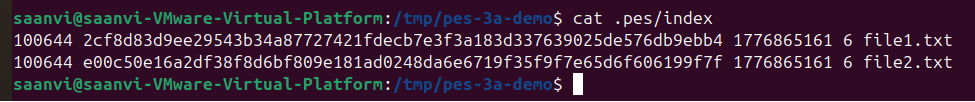
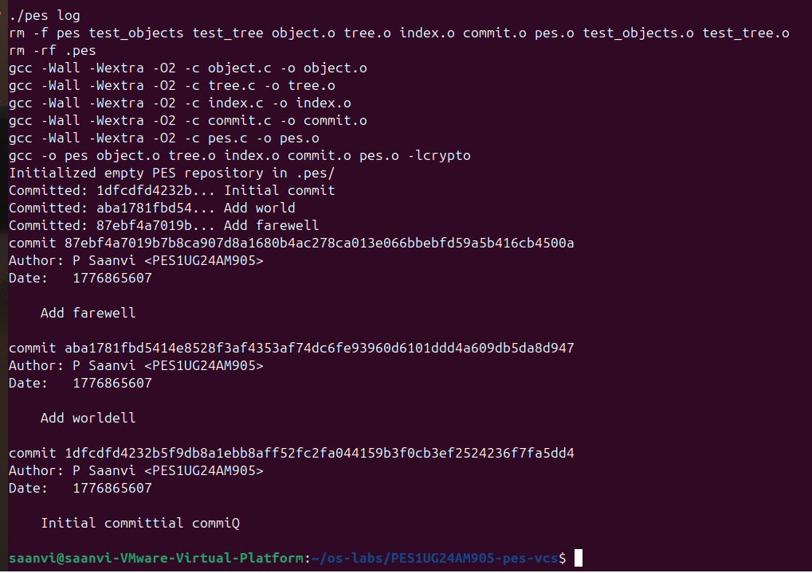
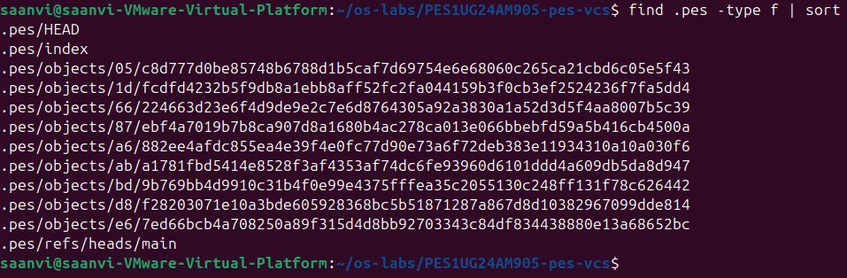
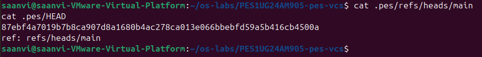
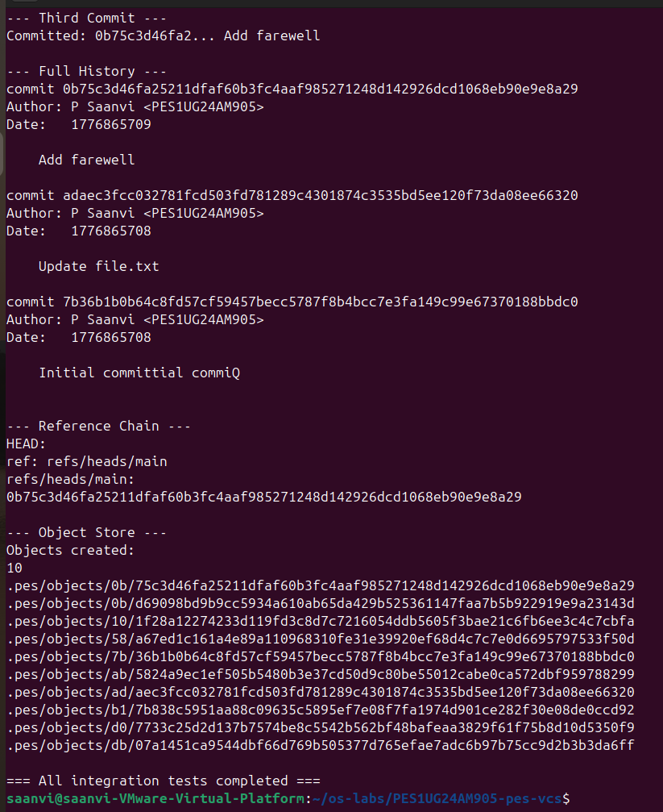

# Building PES-VCS — A Version Control System from Scratch

**Objective:** Build a local version control system that tracks file changes, stores snapshots efficiently, and supports commit history. Every component maps directly to operating system and filesystem concepts.

**Platform:** Ubuntu 22.04

### Brief Overview
This project implements a small local version control system similar to Git. It stores file contents as hashed objects, stages files through an index, builds tree objects to represent directory snapshots, and creates commit objects to track project history. The system supports basic commands like init, add, status, commit, and log, while teaching how real version control tools use the filesystem internally.

---

# PES-VCS Lab Report

### Screenshots Required

| Phase | ID  | What to Capture                                                 |
| ----- | --- | --------------------------------------------------------------- |
| 1     | 1A  | `./test_objects` output showing all tests passing                 |
| 1     | 1B  | `find .pes/objects -type f` showing sharded directory structure  |
| 2     | 2A  | `./test_tree` output showing all tests passing                  |
| 2     | 2B  | `xxd` of a raw tree object (first 20 lines)                    |
| 3     | 3A  | `pes init` → `pes add` → `pes status` sequence                 |
| 3     | 3B  | `cat .pes/index` showing the text-format index                  |
| 4     | 4A  | `pes log` output with three commits                            |
| 4     | 4B  | `find .pes -type f \| sort` showing object growth              |
| 4     | 4C  | `cat .pes/refs/heads/main` and `cat .pes/HEAD`                 |
| Final | --  | Full integration test (`make test-integration`)                 |

---

## Phase 5 & 6: Analysis-Only Questions

### Branching and Checkout

**Q5.1:** A branch in Git is just a file in `.git/refs/heads/` containing a commit hash. Creating a branch is creating a file. Given this, how would you implement `pes checkout <branch>` — what files need to change in `.pes/`, and what must happen to the working directory? What makes this operation complex?

**Ans** To implement `pes checkout <branch>`, first check whether `.pes/refs/heads/<branch>` exists. If it exists, read the commit hash stored in that file, then read the commit object, then read its root tree object. After that, update `.pes/HEAD` to:
```bash
ref: refs/heads/<branch>
```
The working directory must be changed to match the tree of that branch: create required files, update modified files, delete files that are no longer present, and recreate directories. The index should also be updated to match the checked-out commit.

The operation is complex because checkout changes real user files. It must avoid overwriting uncommitted work, handle deleted/modified files, create nested directories, and make sure the working directory, index, and HEAD all stay consistent.

---

**Q5.2:** When switching branches, the working directory must be updated to match the target branch's tree. If the user has uncommitted changes to a tracked file, and that file differs between branches, checkout must refuse. Describe how you would detect this "dirty working directory" conflict using only the index and the object store.

**Ans** To detect a dirty working directory conflict, compare each tracked file in the index with the actual working directory file. For each indexed file, check whether the file still exists and whether its metadata, such as size and modification time, matches the index. For stronger checking, re-hash the working file and compare it with the blob hash stored in the index.

Then compare the current branch’s version of the file with the target branch’s version from the target commit tree. If the working file has uncommitted changes and the target branch has a different version of that same file, checkout should refuse because switching branches would overwrite the user’s changes.

---

**Q5.3:** "Detached HEAD" means HEAD contains a commit hash directly instead of a branch reference. What happens if you make commits in this state? How could a user recover those commits?

**Ans** Detached HEAD means `.pes/HEAD` stores a commit hash directly instead of pointing to a branch file like `refs/heads/main`. If commits are made in this state, the new commits continue from that commit, but no branch name automatically points to them.

The commits are still present in the object store, but they can become hard to find once the user checks out another branch. To recover them, the user can create a new branch pointing to the detached commit hash, for example by writing that hash into `.pes/refs/heads/`recovered.

---

### Garbage Collection and Space Reclamation

**Q6.1:** Over time, the object store accumulates unreachable objects — blobs, trees, or commits that no branch points to (directly or transitively). Describe an algorithm to find and delete these objects. What data structure would you use to track "reachable" hashes efficiently? For a repository with 100,000 commits and 50 branches, estimate how many objects you'd need to visit.

**Ans** Garbage collection can be done using a mark-and-sweep algorithm.

First, read all branch references in `.pes/refs/heads/`. Each branch gives a starting commit hash. From each starting commit, recursively visit its parent commits. For every commit, mark the commit object as reachable, then read its tree and mark all tree and blob objects reachable. For trees, recursively visit child trees and blobs.

Use a hash set to store reachable object hashes efficiently and avoid visiting the same object more than once.

After marking reachable objects, scan all files in `.pes/objects/`. Any object whose hash is not in the reachable set is unreachable and can be deleted.

For 100,000 commits and 50 branches, the maximum number of commits visited is about 100,000 if branches share history and duplicates are skipped using the hash set. The total number of objects visited also includes all reachable trees and blobs, so it may be several times larger depending on project size.

---

**Q6.2:** Why is it dangerous to run garbage collection concurrently with a commit operation? Describe a race condition where GC could delete an object that a concurrent commit is about to reference. How does Git's real GC avoid this?

**Ans** Garbage collection is dangerous during a commit because a commit operation writes several objects before updating the branch reference. For example, `pes commit` may write a blob and tree object, but before it writes the commit object and updates `.pes/refs/heads/main`, garbage collection may run. Since no branch points to those new objects yet, GC may think they are unreachable and delete them. Then the commit operation may create a commit that points to missing objects.

Real Git avoids this using safety mechanisms such as locks, temporary files, grace periods, and conservative pruning. Git usually does not immediately delete very new unreachable objects, which gives concurrent operations time to finish.

---
